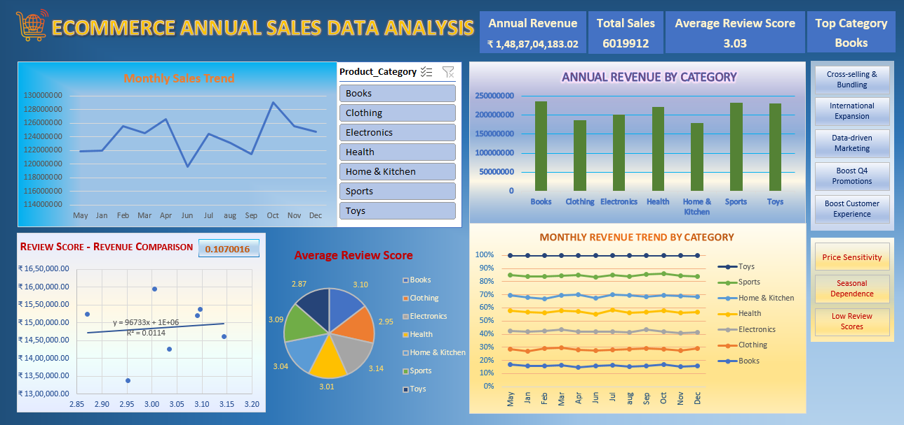

# 🛒 E-Commerce Sales Data Analysis Dashboard


---

## 📌 Project Overview

This project presents an **interactive E-Commerce Sales Analysis Dashboard** built using **Microsoft Excel**.  
The dashboard transforms raw sales data into meaningful visual insights, helping stakeholders understand business performance, customer behavior, and product trends at a glance.

---

## 🎯 Objective

To analyze e-commerce sales data and build a dynamic dashboard that provides:
- A clear view of overall annual business performance
- Identification of top-performing products and categories
- Understanding of customer buying patterns and review scores
- Month-over-month sales trends

---

## 📊 Dashboard Highlights

| Feature | Details |
|--------|---------|
| 💰 Total Sales & Revenue | Overall revenue summary with KPI cards |
| 📅 Monthly/Yearly Trends | Line & column charts showing sales over time |
| 🏆 Top Products & Categories | Best-selling items ranked by revenue & quantity |
| 👥 Customer Insights | Purchase patterns and customer review scores |

---

## 🛠️ Excel Features Used

- ✅ **Pivot Tables** — Summarized large datasets quickly and efficiently
- ✅ **Slicers** — Enabled interactive filtering by category
- ✅ **Charts & Graphs** — Bar charts, line graphs, and pie charts for visual storytelling
- ✅ **Formulas** — Used for data cleaning and calculated metrics
- ✅ **Conditional Formatting** — highlighted key measures
- ✅ **Power query** — Transformed data into right format for efficient analysis

---

## 📁 Files in This Repository

```
Ecommerce-sales-analysis/
│
├── 📊 ecommerce_analysis_Dashboard.xlsx   # Main Excel dashboard file
├── 📸  Dashboard_screenshot.png     # Dashboard preview images
└── 📄 README.md                         # Project documentation
```


## 📸 Dashboard Preview

>  

---

## 📂 Data Source

- **Source:** [Kaggle](https://www.kaggle.com) — Publicly available E-Commerce Sales Dataset
- **Data includes:** Product id, Product price, product categories, sales figures and review scores

---

## 💡 Key Insights from the Dashboard

- 📈 Sales peak during **festive/holiday months**, showing clear seasonal trends
- 🏆 **Top 5 product categories** contribute to majority of total revenue
- 👥 A significant portion of revenue comes from **same product category**
- 📉 Certain categories show **declining trends** — signaling need for strategy change

---

## 🧠 Skills Demonstrated

- Data Cleaning & Preparation
- Exploratory Data Analysis (EDA)
- Dashboard Design & Data Visualization
- Business Insight Generation
- Microsoft Excel (Advanced)

---

## 👩‍💻 About Me

I am a **Post Graduate** with professional work experience, currently upskilling in **Data Analytics**.  
This project is part of my portfolio as I transition into a Data Analyst role.

🔗 **LinkedIn:** https://www.linkedin.com/in/poorani-kumar-945ab03b3/ 
📧 **Email:** poorani.best@gmail.com

---

## 🤝 Let's Connect!

If you're a recruiter or fellow data enthusiast, feel free to reach out.  
I am actively looking for **Data Analyst opportunities**!

---

*⭐ If you found this project helpful, consider giving it a star!*
